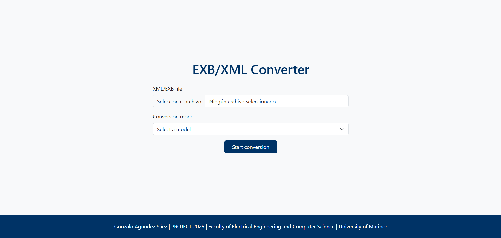

# XML–EXB Converter

A lightweight Flask-based tool for converting and normalizing transcription files in **XML** and **EXB** formats.  
The application processes linguistic tiers, applies a selected text‑conversion model, and generates a new normalized tier while preserving the original structure.

## Interface Preview

Below is a screenshot of the application's main interface:



---

## Features

- Upload **XML** or **EXB** transcription files.
- Automatic parsing and validation of the file structure.
- Detection and processing of tiers with:
  - `category="v"`
  - `type="t"`
- Creation of a new normalized tier (`category="norm"`, `type="t"`).
- Modification of the original tier to (`category="collog"`, `type="a"`).
- Tokenization → model processing → detokenization pipeline.
- Clean and responsive interface using **Bootstrap 5**.
- Download of the converted file with the original extension preserved.
- Docker support for easy deployment.

---

## How It Works

1. The user uploads an XML/EXB file and selects a conversion model.
2. The application parses the file and identifies relevant tiers.
3. For each event inside those tiers:
   - The text is tokenized.
   - It is sent to the selected model (currently simulated).
   - The output is detokenized to restore natural punctuation spacing.
4. A new normalized tier is inserted before the original one.
5. The original tier is re-labeled as a collog tier.
6. The final XML is formatted and returned as a downloadable file.

---

## Project Structure

```
project/
├── app.py
├── Dockerfile
├── requirements.txt
├── README.md
│
├── templates/
│   └── index.html
│
└── static/
    ├── css/
    │   └── styles.css
    ├── js/
    │   └── clean_errors.js
    └── interface.png
```

---

## Installation

### 1. Clone the repository
```bash
git clone https://github.com/gonza-feri/xml-exb-converter.git
cd xml-exb-converter
```

### 2. Create and activate a virtual environment
```bash
python -m venv venv
source venv/bin/activate        # macOS/Linux
venv\Scripts\activate           # Windows
```

### 3. Install dependencies
```bash
pip install -r requirements.txt
```

---

##  Running the Application

### Development mode
```bash
python app.py
```

---

## Running with Docker

### Build the image
```bash
docker build -t xml-exb-converter .
```

### Run the container
```bash
docker run -p 5000:5000 xml-exb-converter
```

---

## Requirements

- Python 3.11+
- Flask
- NLTK
- Docker (optional)

All Python dependencies are listed in `requirements.txt`.

---

## Notes

- The text‑conversion model is currently simulated.  
  The XML‑RPC call is prepared and can be activated once the model server is available.
- The application validates that the uploaded file is **well‑formed XML**, and returns a clear parsing error if not.

---

## License

This project is released for academic and research purposes.

---

## Author

**Gonzalo Agúndez Sáez**  
Faculty of Electrical Engineering and Computer Science  
University of Maribor (FERI)  
Project 2026
