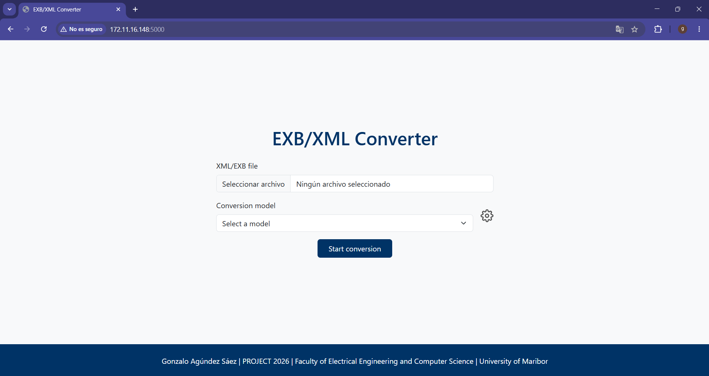
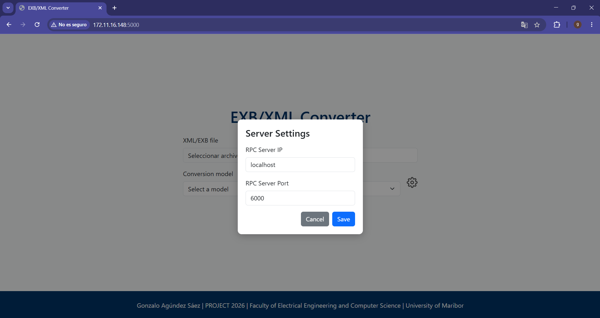

# XML–EXB Converter

A lightweight Flask-based tool for converting and normalizing transcription files in **XML** and **EXB** formats.
The application processes linguistic tiers, applies a selected text-conversion model via XML-RPC, and generates a new normalized tier while preserving the original file structure byte-for-byte.

---

## Interface

| Main form | Server Settings modal |
|:---------:|:---------------------:|
|  |  |

---

## Features

- Upload **XML** or **EXB** transcription files (`.xml` / `.exb`).
- Automatic parsing and validation — clear inline error messages for malformed files.
- Detection and processing of verbatim tiers with `category="v"` **and** `type="t"` simultaneously; all other tiers are left untouched.
- For each matching tier:
  - A new **normalized tier** (`category="norm"`, `type="t"`, id suffixed `_norm`) is inserted immediately before the original.
  - The original tier is relabelled to `category="colloq"`, `type="a"`.
- Full **tokenization → model → detokenization** pipeline using NLTK.
- Two selectable conversion models:
  - **Model 1 – Simple Conversion**: sends a `"model"` parameter to the RPC server.
  - **Model 2 – Full Normalization**: uses the RPC server's default model.
- **Runtime RPC configuration**: change the server IP, port, and timeout from the web interface — no restart needed.
- Original file formatting preserved exactly (no attribute reordering, no whitespace changes).
- Output filename mirrors the input with a `_converted` suffix.
- Clean, responsive single-page interface using **Bootstrap 5**.
- Docker support for easy deployment.

---

## How It Works

1. The user uploads an XML/EXB file and selects a conversion model.
2. The file is parsed with `xml.etree.ElementTree` while the original text is kept verbatim as a separate string.
3. The application iterates over all `<tier>` elements and selects those with `category="v"` and `type="t"`.
4. For each matching tier, each `<event>`'s text goes through:
   - **Tokenization** – `wordpunct_tokenize` splits words and punctuation.
   - **Model dispatch** – text is sent to the RPC server (currently simulated).
   - **Detokenization** – natural punctuation spacing is restored.
5. A new normalized tier (containing the converted events) is inserted into the original text using a regex that locates the opening tag regardless of attribute order.
6. The original tier's attributes are updated in-place in the original text.
7. The modified file is returned as a download, with the original structure intact.

---

## Project Structure

```
xml-exb-converter/
├── app.py                  # All Flask routes and server-side logic
├── config_runtime.json     # RPC server address and timeout (editable at runtime)
├── Dockerfile
├── requirements.txt
├── README.md
├── templates/
│   └── index.html          # Jinja2 template (single-page interface)
└── static/
    ├── css/
    │   └── styles.css      # FERI colour scheme
    ├── js/
    │   └── clean_errors.js # Client-side behaviour (errors, reload, settings)
    ├── interface.png
    └── interface_settings.png
```

---

## Installation

### 1. Clone the repository
```bash
git clone https://github.com/gonza-feri/xml-exb-converter.git
cd xml-exb-converter
```

### 2. Create and activate a virtual environment
```bash
python -m venv venv
source venv/bin/activate      # macOS / Linux
venv\Scripts\activate         # Windows
```

### 3. Install dependencies
```bash
pip install -r requirements.txt
```

---

## Running the Application

```bash
python app.py
```

The application will be available at **http://127.0.0.1:5000**.

---

## Running with Docker

### Build the image
```bash
docker build -t xml-exb-converter .
```

### Run the container
```bash
docker run --rm -p 5000:5000 xml-exb-converter
```

The application is then available at **http://localhost:5000**.

### Persist RPC settings across restarts
Mount `config_runtime.json` as a host volume so changes made through the Settings modal survive container restarts:

```bash
docker run --rm -p 5000:5000 \
    -v $(pwd)/config_runtime.json:/app/config_runtime.json \
    xml-exb-converter
```

---

## Runtime RPC Configuration

The RPC server connection parameters are stored in `config_runtime.json`:

```json
{
    "RPC_SERVER_IP": "localhost",
    "RPC_SERVER_PORT": 6000,
    "RPC_TIMEOUT": 10
}
```

These values can be changed **without restarting the application** by clicking the ⚙️ gear icon next to the model selector in the web interface. The new settings take effect on the next conversion request.

---

## Connecting the Real RPC Server

The XML-RPC conversion pipeline is fully wired. To activate it, uncomment two lines in `convertText()` inside `app.py`:

```python
# url   = f"http://{RPC_SERVER_IP}:{RPC_SERVER_PORT}/RPC2"
# proxy = xmlrpc.client.ServerProxy(url, timeout=RPC_TIMEOUT)
...
# result = proxy.translate(params)['text']
```

Update `config_runtime.json` with the server's IP and port, and the application will forward all conversion requests to it automatically.

---

## Requirements

- Python 3.11+
- Flask 3.1+
- NLTK
- Docker (optional)

All Python dependencies are listed in `requirements.txt`.

---

## License

This project is released for academic and research purposes.

---

## Author

**Gonzalo Agúndez Sáez**  
Faculty of Electrical Engineering and Computer Science  
University of Maribor (FERI)  
Project 2026