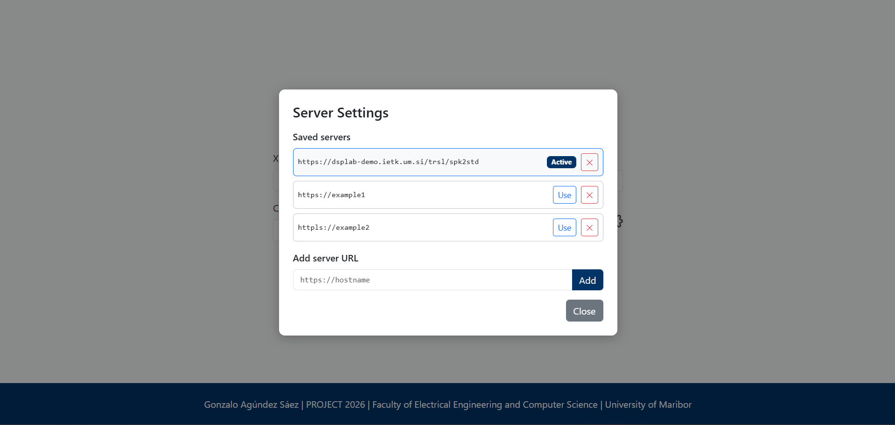

# XML–EXB Converter

A Flask-based web tool for converting and normalizing transcription files in **XML** and **EXB** formats.
The application processes linguistic tiers, delegates text normalization to a Moses RPC server, and generates a new normalized tier while preserving the original file structure byte-for-byte.

---

## Interface

| Main form | Server Settings modal |
|:---------:|:---------------------:|
|  |  |

---

## Features

- Upload **XML** or **EXB** transcription files (`.xml` / `.exb`).
- Automatic parsing and validation — clear inline error messages for malformed files.
- Detection and processing of verbatim tiers with `category="v"` **and** `type="t"` simultaneously; all other tiers are left untouched.
- For each matching tier:
  - A new **normalized tier** (`category="norm"`, `type="t"`, id suffixed `_norm`) is inserted immediately before the original.
  - The original tier is relabelled to `category="colloq"`, `type="a"`.
- Full **tokenization → Moses RPC → detokenization** pipeline using NLTK.
- Two selectable conversion models:
  - **Model 1 – Simple Conversion**: sends a `"model"` parameter to the Moses server.
  - **Model 2 – Full Normalization**: uses the Moses server's default model.
- **Real-time progress bar**: conversion runs in a background thread; the browser shows *"Processing event X of N…"* as events complete.
- **Multi-URL runtime configuration**: save multiple server URLs, switch between them from the web interface — no restart needed.
- Original file formatting preserved exactly (no attribute reordering, no whitespace changes).
- Output filename mirrors the input with a `_converted` suffix.
- Clean, responsive single-page interface using **Bootstrap 5**.
- Docker support for easy deployment.

---

## How It Works

1. The user uploads an XML/EXB file and selects a conversion model.
2. The file is parsed with `xml.etree.ElementTree` while the original text is kept verbatim as a separate string.
3. The application iterates over all `<tier>` elements and selects those with `category="v"` and `type="t"`.
4. A background thread processes each matching tier: for each `<event>`, the text goes through **tokenization** (NLTK), a **Moses XML-RPC call**, and **detokenization**. The browser polls `/progress/<job_id>` every 500 ms to update the progress bar.
5. A new normalized tier is inserted into the original text using a regex that locates the opening tag regardless of attribute order.
6. The original tier's attributes are updated in-place in the original text.
7. The modified file is returned as a download, with the original structure intact.

---

## Project Structure
xml-exb-converter/
├── app.py                  # All Flask routes and server-side logic
├── config_runtime.json     # Active server URL and list of saved servers
├── Dockerfile
├── requirements.txt
├── README.md
├── templates/
│   └── index.html          # Jinja2 template (single-page interface)
└── static/
├── css/
│   └── styles.css      # FERI colour scheme
├── js/
│   └── clean_errors.js # Client-side behaviour (errors, fetch, settings)
├── interface.png
├── progress_bar.png
└── server_settings.png

---

## Installation

### 1. Clone the repository
```bash
git clone https://github.com/gonza-feri/xml-exb-converter.git
cd xml-exb-converter
```

### 2. Create and activate a virtual environment
```bash
python -m venv venv
source venv/bin/activate      # macOS / Linux
venv\Scripts\activate         # Windows
```

### 3. Install dependencies
```bash
pip install -r requirements.txt
```

---

## Running the Application

```bash
python app.py
```

The application will be available at **http://127.0.0.1:5000**.

---

## Running with Docker

### Build the image
```bash
docker build -t xml-exb-converter .
```

### Run the container
```bash
docker run --rm -p 5000:5000 xml-exb-converter
```

The application is then available at **http://localhost:5000**.

### Persist RPC settings across restarts
Mount `config_runtime.json` as a host volume so saved server URLs survive container restarts:

```bash
docker run --rm -p 5000:5000 \
    -v $(pwd)/config_runtime.json:/app/config_runtime.json \
    xml-exb-converter
```

---

## Runtime RPC Configuration

The active server URL and all saved servers are stored in `config_runtime.json`:

```json
{
    "RPC_SERVER_URL": "https://your-moses-server/RPC2",
    "saved_urls": [
        "https://your-moses-server/RPC2"
    ]
}
```

These values can be changed **without restarting the application** by clicking the ⚙️ gear icon in the web interface. The modal supports adding new server URLs, switching between saved ones, and deleting any entry. Changes take effect on the next conversion request.

---

## Requirements

- Python 3.11+
- Flask 3.1+
- NLTK
- Docker (optional)

All Python dependencies are listed in `requirements.txt`.

---

## License

This project is released for academic and research purposes.

---

## Author

**Gonzalo Agúndez Sáez**  
Faculty of Electrical Engineering and Computer Science  
University of Maribor (FERI)  
Project 2026